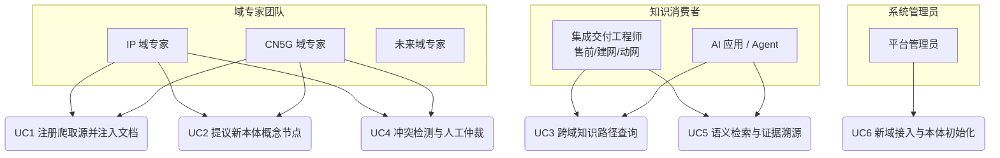
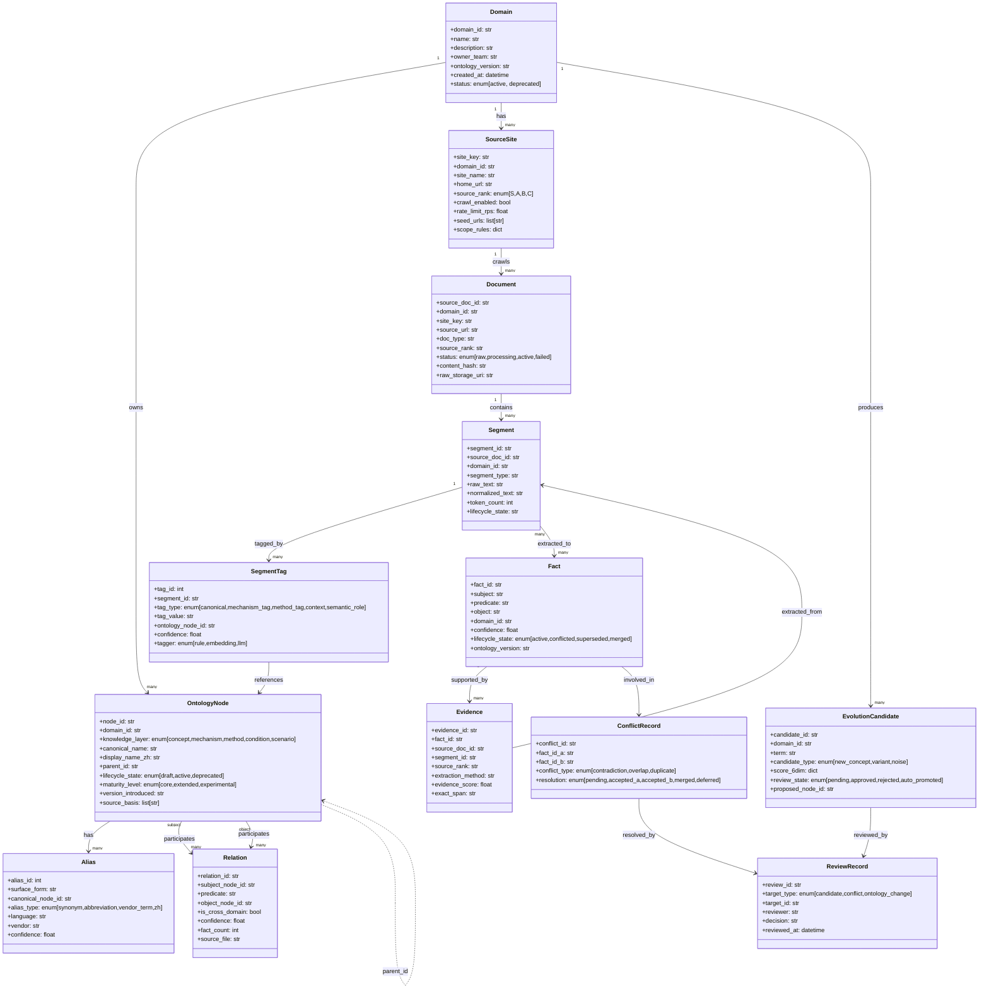
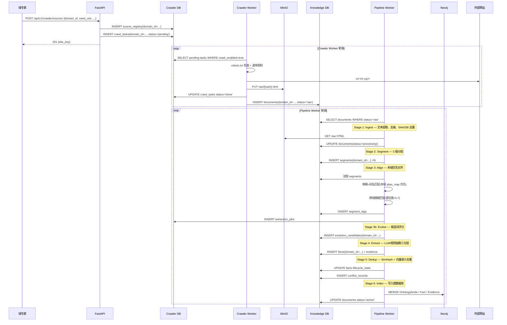
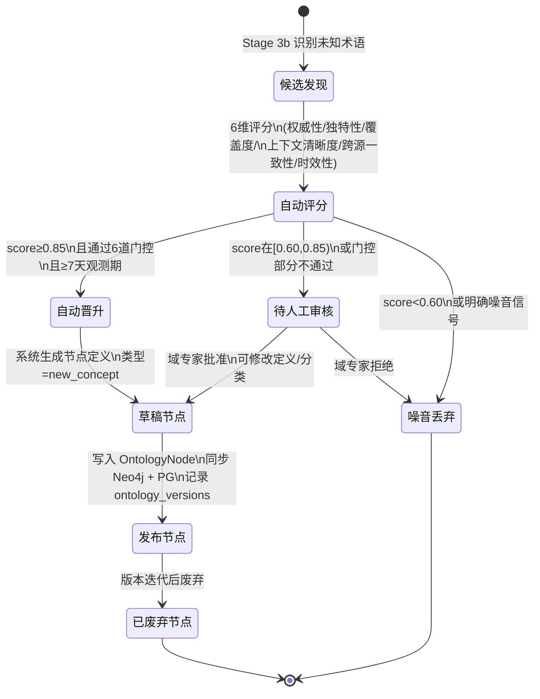
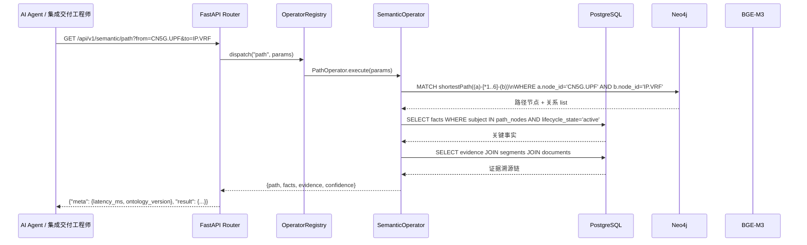
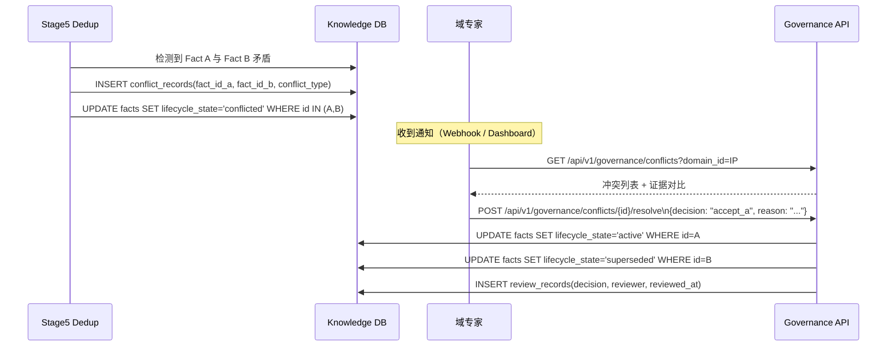
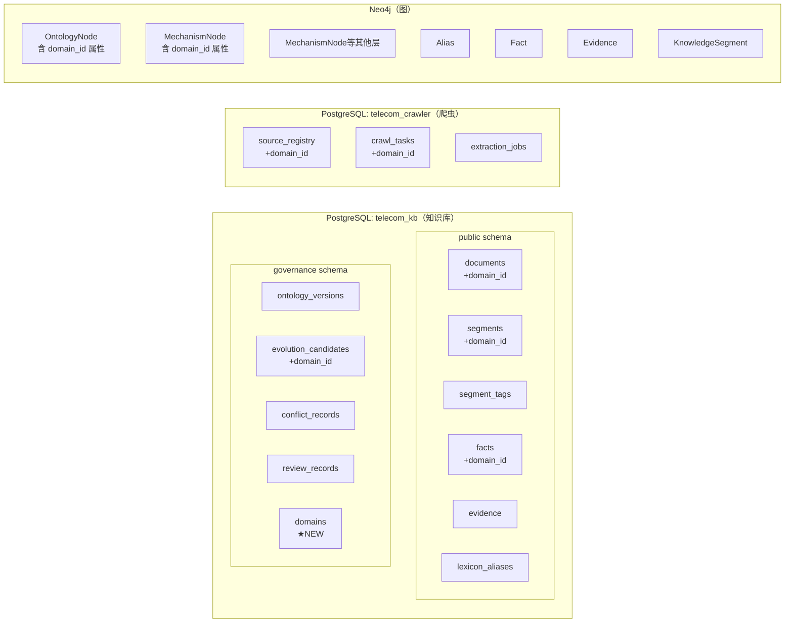
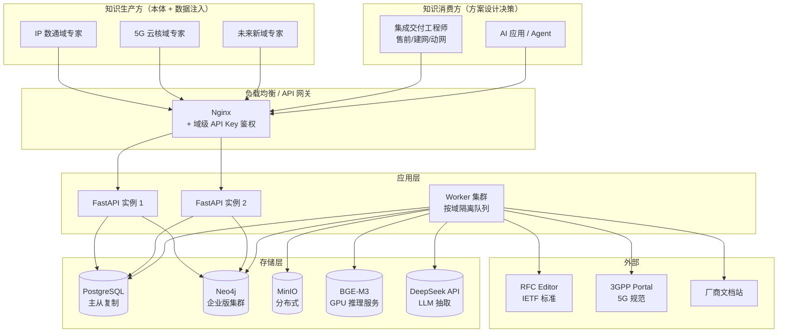

# 电信语义知识库 — 产品架构设计（4+1 视图）
**版本：2.0 | 日期：2026-04-13**
**方法论：Kruchten 4+1 视图模型**

---

## 0. 产品定位重述

本系统是一套**多专业域共享的语义知识基础设施**，面向**网络集成交付工程师**在售前看网、建网、动网全流程中的方案设计决策支撑需求。

**目标用户**：网络集成交付工程师——在有限的现场时间内，需要快速检索跨厂商、跨版本、跨专业域的配置依赖链、约束条件和典型交付场景，以支撑从现网评估到方案落地的全流程决策。

**典型知识消费场景**：
- **售前看网**：现网运行 BGP+MPLS L3VPN，叠加 5G CN 后 N6 接口与现网 VRF 如何隔离？有哪些约束条件？
- **建网**：同类园区网络改造项目的典型部署场景是什么？华为/思科配置有何差异？
- **动网**：计划扩容 BGP RR，影响域有哪些关联配置对象？变更窗口需要考虑哪些风险？

核心产品主张：
- 多个专业域团队（IP 数通、5G 云核、光传输、RAN…）**独立管理各自本体和数据源**
- 共享同一套**后端存储、管道、语义算子**基础设施
- 支持**跨域知识关联**（不同域的概念可以建立关系）
- 每条知识均携带**域归属、来源溯源、置信度**元数据，工程师可判断结论来自 RFC 还是厂商白皮书

---

## 1. 场景视图（+1）— 驱动架构的关键用例

4+1 中的 "+1" 是场景视图，定义哪些使用场景驱动了架构决策。



### UC1 — 注册爬取源并注入文档

**参与者**：域专家  
**前置条件**：域已在平台注册，爬取源 URL 符合 robots.txt  
**主流程**：
1. 专家通过 API 注册 `SourceSite`，绑定到自己的 `domain_id`
2. 系统将 seed URLs 写入 `crawl_tasks`，标记 `domain_id`
3. Crawler Worker 按域配置的速率抓取 HTML，存入 MinIO
4. 写入 `documents(domain_id=…, status='raw')`
5. Pipeline Worker 自动触发 7 阶段管道
6. Align 阶段**优先匹配本域本体**，跨域匹配降低置信度

**关键架构决策**：`domain_id` 必须从 SourceSite → crawl_tasks → documents → segments → facts 全链路传递。

---

### UC2 — 提议新本体概念节点

**参与者**：域专家  
**前置条件**：Pipeline Stage 3b 产生了 `evolution_candidates` 记录  
**主流程**：
1. Stage 3b 对候选词进行 6 维评分，score ≥ 0.85 且通过 6 道门控 → 标记 `auto_promote`
2. 域专家在管理界面查看待审候选，可手动修改分类/定义
3. 专家批准 → 系统在 `domains/{domain_id}.yaml` 写入新节点（API-first 模式下写入数据库）
4. 触发 `load_ontology` 增量同步：`OntologyNode` 写入 Neo4j + PG lexicon
5. `ontology_versions` 记录版本快照，`review_records` 记录审批人

**关键架构决策**：YAML 是**初始化 source of truth**，生产环境增量变更由 API + governance 表驱动，YAML 定期从数据库导出同步。

---

### UC3 — 跨域配置依赖路径查询

**参与者**：集成交付工程师（建网/动网阶段）/ AI Agent  
**典型场景**：工程师规划将 5G CN 的 N6 接口接入现有 IP VRF 网络，需要了解 UPF 与 BGP/VRF 之间的配置依赖链，判断现网是否需要改造。  
**示例**：`path(CN5G.UPF, IP.VRF)` — UPF 到 VRF 的关联路径及约束条件  
**主流程**：
1. 调用 `/api/v1/semantic/path?from=CN5G.UPF&to=IP.VRF`
2. `PathOperator` 在 Neo4j 做 `shortestPath` 遍历，跨越 `CROSS_DOMAIN` 关系边
3. 返回路径节点 + 每段关系类型（depends_on / configured_by / constrained_by）+ 置信度 + 来源证据（RFC / 3GPP TS 编号）
4. 工程师据此判断：N6 接口需要独立 VRF 隔离，且需在 UPF 侧配置静态路由或 BGP peer

**关键架构决策**：Neo4j 中跨域关系边需标记 `is_cross_domain=true`；`alias_map` 的域隔离不能影响跨域查询能力。

---

### UC4 — 冲突检测与人工仲裁

**参与者**：域专家  
**主流程**：
1. Stage 5 (Dedup) 检测到两条 Fact 语义相似但内容矛盾 → 写入 `conflict_records`
2. 系统通知域专家（Webhook / 管理界面）
3. 专家在管理界面选择：接受 A / 接受 B / 合并 / 标记待定
4. `governance.review_records` 记录决策，状态机推进 Fact lifecycle

---

### UC5 — 方案设计语义检索与证据溯源

**参与者**：集成交付工程师（售前看网/建网阶段）/ AI Agent  
**典型场景**：售前工程师需要评估客户现网 OSPF + BGP 双协议环境下引入 SR-MPLS 的可行性，需要快速检索约束条件和典型部署场景，并能追溯结论来源（是 RFC 还是厂商手册）以判断适用性。  
**主流程**：
1. 调用 `semantic_search(query="SR-MPLS 与 BGP 共存约束", domain_filter="IP")`
2. 先向量检索 segments，再按 `ontology_fit`（是否命中本域本体节点）排序
3. 返回：匹配 Fact（S-P-O 三元组）+ Evidence（原文段落）+ SourceDocument（URL/RFC 编号/标准版本）
4. 置信度公式 `0.30×source_authority + 0.20×extraction_method + …` 展示在结果中，工程师可据此判断结论是来自 IETF RFC（权威性 1.0）还是厂商白皮书（0.65）

---

### UC6 — 新域接入与本体初始化

**参与者**：平台管理员 + 新域专家  
**主流程**：
1. 管理员通过 `/api/v1/admin/domains` 创建新 Domain 记录
2. 新域专家准备 YAML 本体文件（5 层），遵循 `{DOMAIN_ID}.{LAYER}.{NAME}` 命名规范
3. 调用 `POST /api/v1/admin/domains/{id}/load_ontology` 初始化
4. 分配爬取源，系统自动纳入多域管道

---

## 2. 逻辑视图 — 领域模型

描述系统核心概念实体、它们的属性和关系。



### 核心不变式

| 不变式 | 说明 |
|---|---|
| **域 ID 命名空间** | `node_id` 格式必须为 `{DOMAIN_ID}.{NODE_NAME}` 或 `{DOMAIN_ID}.{LAYER_PREFIX}.{NAME}` |
| **domain_id 全链路** | Document → Segment → Fact 的 domain_id 必须一致 |
| **跨域关系合法性** | Relation 的 subject/object 可以属于不同 Domain，但必须显式标记 `is_cross_domain=true` |
| **Fact 可溯源性** | 每条 active Fact 至少有 1 条 Evidence |
| **候选词域归属** | EvolutionCandidate 必须绑定 domain_id，审核人必须是该域的 editor 或 admin |

---

## 3. 过程视图 — 运行时工作流

描述系统在运行时的主要交互序列。

### 3.1 文档注入全流程（UC1 展开）



---

### 3.2 本体演化工作流（UC2 展开）



---

### 3.3 语义查询流程（UC3/UC5 展开）



---

### 3.4 冲突仲裁工作流（UC4 展开）



---

## 4. 开发视图 — 代码组织结构

描述代码的包层次和模块边界。

```mermaid
graph TB
    subgraph semcore["semcore/ — 零依赖框架层（可独立发布）"]
        SC1[semcore.core\nPipelineContext / SemanticApp]
        SC2[semcore.pipeline\nPipeline / Stage ABCs]
        SC3[semcore.providers\nRelationalStore / ObjectStore ABCs]
        SC4[semcore.operators\nSemanticOperator ABC]
    end

    subgraph src["src/ — 电信领域实现层"]
        subgraph domain_model["domain/ — 领域模型（NEW）"]
            DM1[domain.entities\nDomain / OntologyNode / Fact…]
            DM2[domain.registry\nDomainRegistry（多域管理）]
        end

        subgraph ontology["ontology/"]
            ON1[ontology.registry\nOntologyRegistry（单例缓存）]
            ON2[ontology.loader\nYAML→DB 同步]
            ON3[ontology.validator\n节点 ID 规范校验]
        end

        subgraph pipeline["pipeline/"]
            PL1[stages.stage1_ingest]
            PL2[stages.stage2_segment]
            PL3[stages.stage3_align\n域优先匹配]
            PL4[stages.stage3b_evolve]
            PL5[stages.stage4_extract]
            PL6[stages.stage5_dedup]
            PL7[stages.stage6_index]
            PLF[pipeline_factory]
        end

        subgraph api["api/"]
            API1[api.semantic.router\n21 个语义算子端点]
            API2[api.ontology.router\n本体 CRUD 端点（NEW）]
            API3[api.admin.router\n域管理端点（NEW）]
            API4[api.governance.router\n候选审核 + 冲突仲裁（NEW）]
        end

        subgraph operators["operators/"]
            OP1[21 个 SemanticOperator 实现]
        end

        subgraph crawler["crawler/"]
            CR1[spider.Spider\nHTTP 抓取 + robots]
            CR2[crawler.worker\n轮询 crawl_tasks]
        end

        subgraph db["db/"]
            DB1[db.postgres\npsycopg2 适配器]
            DB2[db.neo4j_client\nneo4j driver 适配器]
            DB3[db.minio_client\nMinIO 适配器]
            DB4[db.embedding_client\nBGE-M3 HTTP 客户端]
        end

        subgraph dev["dev/ — 内存替代（开发/测试）"]
            DEV1[dev.fake_postgres]
            DEV2[dev.fake_neo4j]
            DEV3[dev.fake_crawler_postgres]
            DEV4[dev.seed]
        end
    end

    subgraph config["配置 / 静态资产"]
        CFG1[ontology/domains/*.yaml\n各域本体定义]
        CFG2[ontology/top/relations.yaml]
        CFG3[ontology/lexicon/aliases.yaml]
        CFG4[ontology/seeds/*.yaml]
        CFG5[ontology/patterns/*.yaml]
    end

    SC2 --> PL1
    SC4 --> OP1
    SC3 --> DB1
    SC3 --> DB2
    SC3 --> DB3

    DM2 --> ON1
    ON1 --> CFG1
    ON2 --> CFG1

    PL3 --> ON1
    PL3 --> DM2
    PLF --> PL1

    API1 --> OP1
    API2 --> ON2
    API3 --> DM2
    API4 --> DB1

    CR1 --> DB3
    CR2 --> CR1

    DEV1 -.替代.- DB1
    DEV2 -.替代.- DB2
    DEV3 -.替代.- DB1
```



### 模块边界规则

| 规则 | 说明 |
|---|---|
| `semcore` 不依赖 `src` | semcore 是纯 ABC 框架，零业务逻辑 |
| `pipeline` 不直接访问 `db` | 通过 `app.store` / `app.crawler_store` 抽象访问 |
| `api` 不执行业务逻辑 | 业务逻辑在 `operators/`，API 层只做路由 + 参数校验 |
| `ontology/registry.py` 是只读缓存 | 本体写入通过 `ontology/loader.py`，不绕过 |
| `dev/` 完整替代 `db/` | 测试环境注入 fake 模块后行为与生产等价 |

---

## 5. 物理视图 — 部署架构

### 5.1 当前部署（单机 WSL2）

```mermaid
graph TB
    subgraph host["Windows 11 宿主机"]
        subgraph wsl["WSL2 Ubuntu"]
            subgraph proc["进程"]
                P1["FastAPI\n:8001\n(uvicorn)"]
                P2["Worker\n4线程\n(Crawler/Pipeline/Stats/Maintenance)"]
                P3["BGE-M3 Embedding\n:8000\n(systemd 服务)"]
            end

            subgraph storage["存储"]
                S1[("PostgreSQL\n192.168.3.71\ntelecom_kb\ntelecom_crawler")]
                S2[("Neo4j\n:7687\n图数据库")]
                S3[("MinIO\n:9000\n原始文档对象存储")]
            end

            subgraph fs["文件系统"]
                F1["ontology/*.yaml\n(Git 版本控制)"]
                F2[".env 配置"]
            end
        end

        CLIENT["浏览器 / CLI\nhttp://localhost:8001"]
    end

    P1 <--> S1
    P1 <--> S2
    P1 <--> P3
    P2 <--> S1
    P2 <--> S2
    P2 <--> S3
    P2 <--> P3
    P1 --> P2 : 任务触发
    F1 --> P1 : 启动时加载
    CLIENT --> P1
```

### 5.2 数据库 Schema 分布



### 5.3 目标部署（多域生产环境）



---

## 6. 架构关键决策记录（ADR）

### ADR-01：节点 ID 命名空间必须域作用域化

**决策**：所有层的节点 ID 统一格式为 `{DOMAIN_ID}.{NODE_NAME}`

**当前问题**：mechanism/method/condition/scenario 层使用全局前缀（`MECH.*`、`METHOD.*`），导致：
- `facts.domain` 从 `node_id.split(".")[0]` 得到 `"MECH"` 而非 `"IP"/"CN5G"`
- `get_domain_nodes("CN5G")` 漏掉该域所有非概念节点
- 两域相同层的节点在 `alias_map` 中存在潜在覆盖风险

**方案**：
```
旧: MECH.LinkStateFlooding  →  新: IP.MECH.LinkStateFlooding
旧: MECH.5G_AKA             →  新: CN5G.MECH.5G_AKA
旧: METHOD.SlicePlanningMethod → 新: CN5G.METHOD.SlicePlanningMethod
旧: COND.SmallScaleApplicability → 新: IP.COND.SmallScaleApplicability
旧: SCENE.eMBBSliceProvisioning → 新: CN5G.SCENE.eMBBSliceProvisioning
```

**影响范围**：所有 YAML 文件 + seed relations + aliases + `stage4_extract.py` domain 赋值逻辑

---

### ADR-02：domain_id 必须全链路传递

**决策**：在以下表中增加 `domain_id` 列

| 表 | 来源 |
|---|---|
| `governance.domains` | 新建，存储域元数据 |
| `source_registry` | 注册时由专家指定 |
| `crawl_tasks` | 继承自 source_registry |
| `documents` | 继承自 crawl_task |
| `segments` | 继承自 document |
| `governance.evolution_candidates` | 继承自 segment |

`facts.domain_id` 通过 `subject` 节点的 `domain_id` 属性推导（节点命名空间化后可直接从前缀获取）。

---

### ADR-03：YAML 是初始化 source of truth，API 驱动增量变更

**决策**：

```
初始化阶段：YAML → load_ontology.py → DB (一次性)
        ↓
生产运营阶段：API (POST /ontology/nodes) → DB → 定期导出 YAML 快照
```

理由：
- YAML 适合版本控制和冷启动，但不适合运营时的频繁增量变更
- 生产环境的本体变更需要 governance 审计链（谁改的、何时改的、为何改）
- YAML 快照（从 DB 导出）保持 Git 可追溯性

---

### ADR-04：Stage 3 Align 采用域优先 + 跨域降权策略

**决策**：

```python
# 伪代码
for surface, node_id in ontology.alias_map.items():
    if node_id.startswith(doc_domain_id + "."):
        conf = base_conf          # 本域：置信度不变
    else:
        conf = base_conf * 0.70   # 跨域：降 30%
```

理由：
- 完全域隔离会丢失真实的跨域关联（CN5G 文档中确实会出现 IP 术语）
- 置信度降权让跨域标签可见但不主导
- 跨域 Fact 通过 `is_cross_domain=true` 标记，可单独过滤

---

### ADR-05：fake_neo4j 需支持 domain_id 属性过滤

**决策**：`fake_neo4j.run_query` 的 Pattern 1/2 增加 `domain_id` 过滤支持，与 `scope` 参数语义统一，但 `scope` 改为精确匹配 `domain_id`（不再是前缀匹配 `domain` 字符串）。

---

## 7. 待实现工作项（按优先级）

| 优先级 | 工作项 | 涉及文件 | ADR |
|---|---|---|---|
| P0 | 所有 YAML 节点 ID 命名空间化 | `ontology/domains/*.yaml`，seed files | ADR-01 |
| P0 | `OntologyRegistry._load_domain()` 注入 `domain_id` 到节点 | `src/ontology/registry.py` | ADR-01 |
| P0 | `stage4_extract.py` domain 赋值从节点 `domain_id` 属性获取 | `src/pipeline/stages/stage4_extract.py` | ADR-01 |
| P1 | `documents`/`segments` 增加 `domain_id` 列 | `scripts/init_postgres.sql`，`src/dev/fake_postgres.py` | ADR-02 |
| P1 | `source_registry`/`crawl_tasks` 增加 `domain_id` 列 | `scripts/init_crawler_postgres.sql`，`src/dev/fake_crawler_postgres.py` | ADR-02 |
| P1 | `governance.domains` 表 + 域管理 API | 新建 `src/api/admin/` | ADR-02 |
| P1 | Stage 3 Align 域优先匹配逻辑 | `src/pipeline/stages/stage3_align.py` | ADR-04 |
| P2 | Governance API（候选审核 + 冲突仲裁端点） | 新建 `src/api/governance/` | — |
| P2 | 本体 CRUD API（节点/关系增删改） | 新建 `src/api/ontology/` | ADR-03 |
| P3 | 域级 API Key 鉴权中间件 | 新建 `src/auth/` | — |

---

*文档维护说明：本文档应在每次架构级决策后更新，P0/P1 工作项完成后对应 ADR 标记为 `[IMPLEMENTED]`。*
